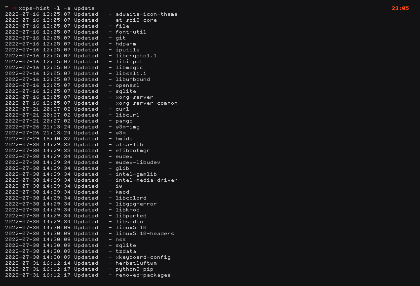
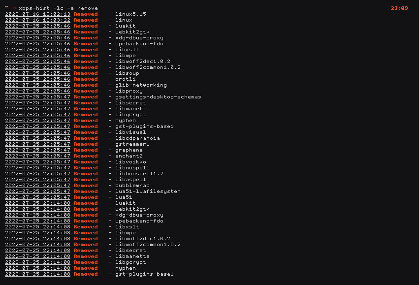
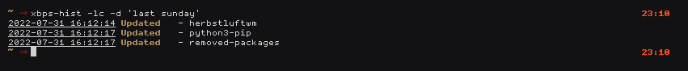
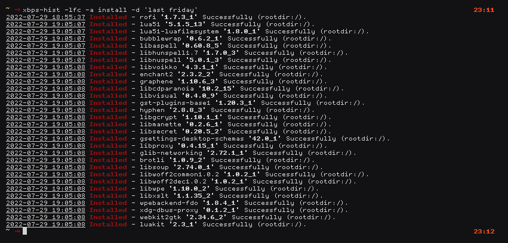

# Xbps-hist [0.1.1]

## About

[Xbps-hist] xbps Log Viewer

[Xbps-hist] allows you to...

* List all Actions in log file
* List by Action
* List by Date
* Search for a Package
* Search for a Package in a Date
* Search for a Package with a Action
* Toggle color Display

## Quick Start

* Installation requires :

	* [Socklog-void](https://github.com/voidlinux/socklog-void) : Void Linux socklog configuration
    * [Coreutils](https://www.gnu.org/software/coreutils) for Everything else

* Set up [Xbps-hist]:

	``` bash
	git clone https://github.com/zakariaGatter/xbps-hist.git
    cd xbps-hist
    git checkout tags/v0.1.1
	mkdir -p ~/.local/bin
	cp xbps-hist/bin/xbps-hist ~/.local/bin
	chmod +x ~/.local/bin/xbps-hist
	```

## Using Xbps-hist

```
XBPS-HIST-0.1.1: Xbps Log Viewer in Pure Bash
USAGE: xbps-hist [OPTIONS] ...

OPTIONS:
    -a <action> Set the <action> you looking for
    -d <date>   Set Date to search
    -s <pkg>    Search for special Package
    -l          List log Info depends on '-a,-d,-s'
    -f          Dispaly Full Log Info
    -c          Enable Colors
    -S <date>   Display all long SINCE a Date
    -T <date>   Dispaly all logs UNTIL a Date
    -h          Show this help dialog and exit
    -v          Show Application version

NOTE:
    the serach start from the day you:
        Install 'socklog-void'
        Enable 'socklog-unix,nanoklogd'
        Add $USER to socklog Group

    <action>:
        Xbps action like [install,remove,update]

    <date>:
        you can use simple form like 'YYYY-MM-DD'
        or human readable for see 'man date'
```

## Preview





## Examples
```bash
    $ xbps-hist -l
    $ xbps-hist -a install -l
    $ xbps-hist -a install -d "2019-10-21" -l
    $ xbps-hist -s socklog-void
    $ xbps-hist -a install -s socklog-void
    $ xbps-hist -a install -d "last month" -s socklog-void
    $ xbps-hist -S '2022-08-29' -T '2022-09-04'
```

## Future Versions
[X] Get information in a Interval Date (Since, To)

## TODO
[Xbps-hist] is a work in progress, so any ideas and patches are appreciated.

[Xbps-hist]:http://github.com/zakariagatter/xbps-hist
